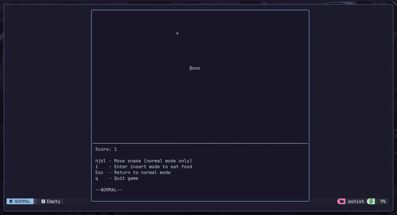

<h1 align="center">snake.nvim</h1>

<p align="center">
Minimal ASCII snake game for Neovim to train your <code>hjkl</code> motions and mode switching muscle memory
</p>

<div align="center">

</div>

## Features

- **`hjkl` movement** - Practice Vim motions
- **Modal gameplay** - Switch between normal and insert mode to eat food
- **ASCII graphics** - Minimal, distraction-free visuals
- **Lightweight** - Zero dependencies, pure Lua

## How to Play

1. Use `hjkl` keys to move the snake (normal mode only)
2. Navigate to food (`*`) and press `i` to enter insert mode
3. Eat the food while in insert mode to grow
4. Press `Esc` to return to normal mode and continue moving
5. Avoid hitting yourself - Game over!

## Installation

### lazy.nvim

```lua
{
    'ashish0kumar/snake.nvim',
    cmd = 'Snake',
    config = function()
    require('snake').setup()
    end
}
```

### packer.nvim

```lua
use {
    'ashish0kumar/snake.nvim',
    cmd = 'Snake',
    config = function()
    require('snake').setup()
    end
}
```

### vim-plug

```
Plug 'ashish0kumar/snake.nvim'
```


## Usage

Start the game with:

```
:Snake
```

## Controls

| Key | Action |
|-----|--------|
| `h` `j` `k` `l` | Move snake (normal mode only) |
| `i` | Enter insert mode to eat food |
| `Esc` | Return to normal mode |
| `q` | Quit game |
| `r` | Restart game (when game over) |

## Contributing

Feel free to open issues or submit pull requests!

## License

[MIT License](LICENSE)
